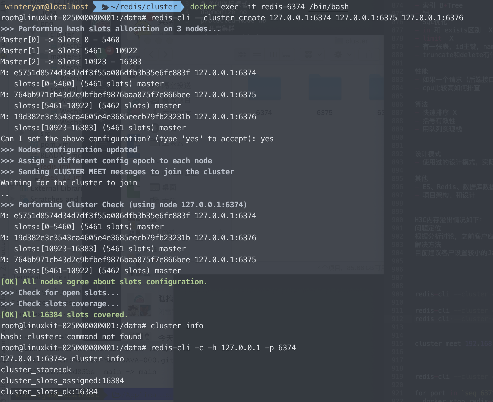

### 主从复制
- 使用两个节点一主一从
- 使用SLAVEOF方式


### Sentinel哨兵
使用一主两从，哨兵配置三个


### Cluster集群
- 某个节点配置文件如下
```$xslt
# redis端口
port 6374
# 关闭保护模式
daemonize no
protected-mode no
# 开启集群
cluster-enabled yes
# 集群节点配置
cluster-config-file nodes.conf
# 超时
cluster-node-timeout 5000
# 集群节点IP host模式为宿主机IP
cluster-announce-ip 127.0.0.1
# 集群节点端口
cluster-announce-port 6374
cluster-announce-bus-port 16374
# 开启 appendonly 备份模式
appendonly yes
```
- 三个Cluster集群节点，开始未成功配置（一直waiting），后使用host网络模式，并修改总线ip为127.0.0.1配置成功


