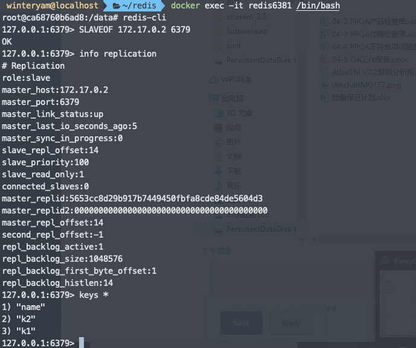
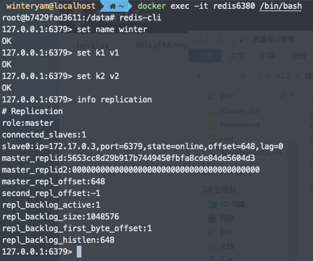
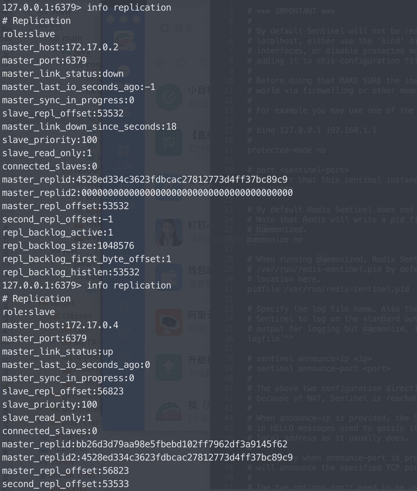
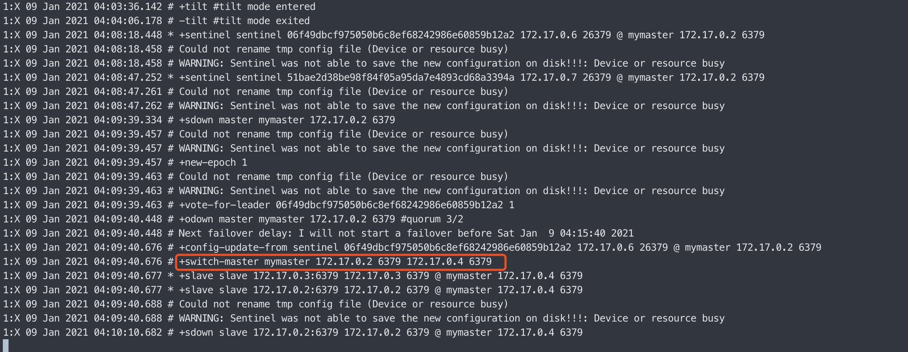
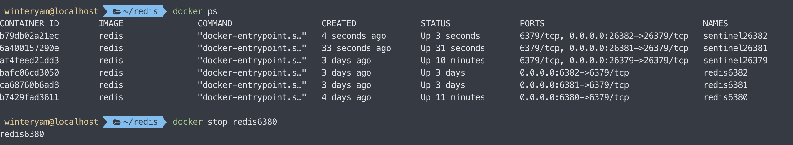
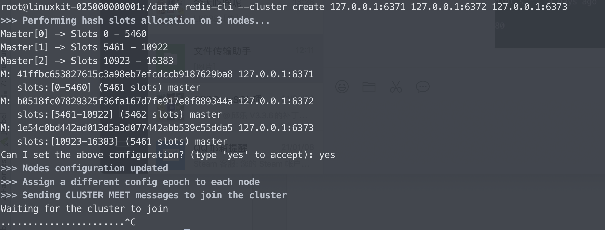

### 主从复制
- 使用两个节点一主一从
- 使用SLAVEOF方式




### Sentinel哨兵
使用一主两从，哨兵配置三个






### Cluster集群
- 三个Cluster集群节点，但未成功配置（等待其他节点接入）
- 某个节点配置文件如下
```$xslt
# redis端口
port 6373
# 关闭保护模式
protected-mode no
daemonize no
# 开启集群
cluster-enabled yes
# 集群节点配置
cluster-config-file nodes.conf
# 超时
cluster-node-timeout 5000
# 集群节点IP host模式为宿主机IP
cluster-announce-ip 192.168.43.170
# 集群节点端口 7001 - 7006
cluster-announce-port 6373
cluster-announce-bus-port 16373
# 开启 appendonly 备份模式
appendonly yes
```
