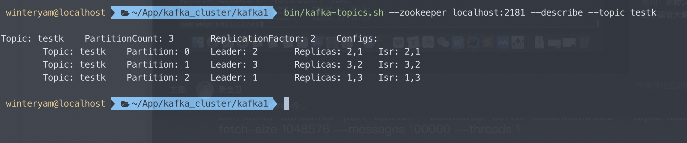
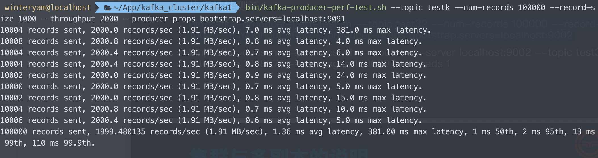
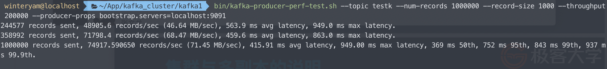

### ActiveMQ 服务，基于JMS，实现queue 和 topic 的消息生产和消费
`my.homework.mq.activemq`
- 使用Spring自带的`JmsMessageTemplate`集成ActiveMQ

### 使用Spring Kafka实现通讯
`my.homework.mq.kafka`
- 使用KafkaTemplate进行发布订阅

### Kafka集群性能测试
Kafka副本和partition情况如图

10万消息，2000吞吐量限制情况

100万消息，20万吞吐量限制情况

