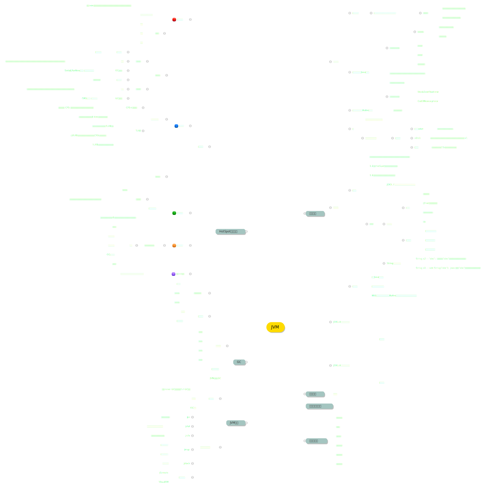

#### 知识总结
常见问题及排查思路
- OOM：通过GC日志查看新生代和老年代内存变化；并通过jmap或OOM的dump文件，查看占用内存最大的对象及对象所在内存区域（MAT可以查看），再对对象所在方法逐层分析。
- CPU很高：通过jstack分析java线程使用情况，和是否有死锁，并且可以通过JProfiler等工具，检查各方法占用CPU时间。
- 频繁GC：长时间监控GC的规律，对GC的时间点进行内存分析，使用jmap分析输出dump文件，同OOM。
